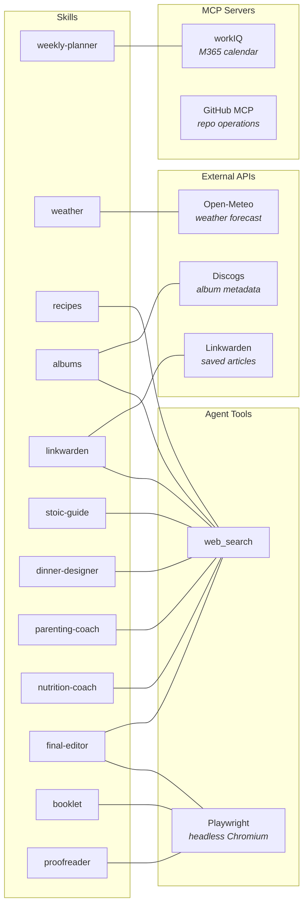
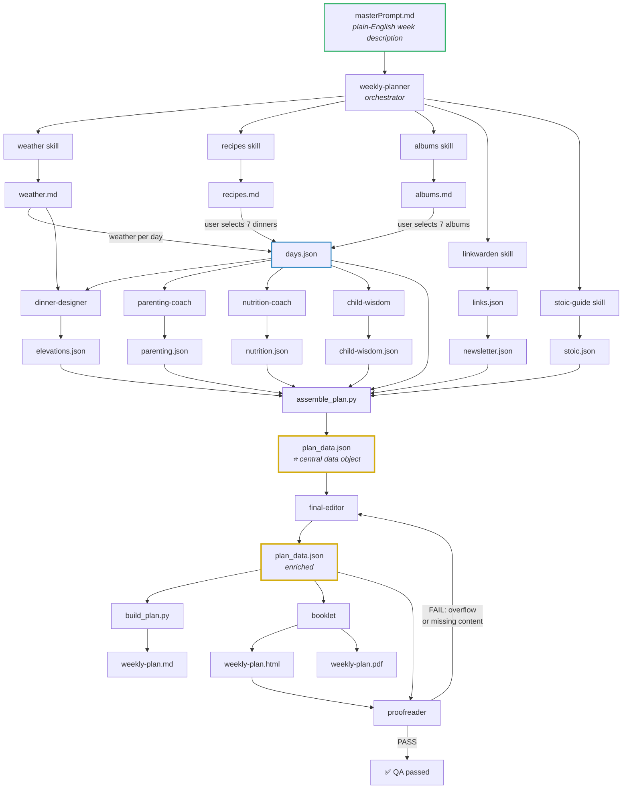

# Weekly Family Planner

A multi-agent AI system that transforms a freeform paragraph about your upcoming week into a rich, printed family booklet — complete with dinners, music pairings, chef's tips, parenting insights, Stoic reflections, a children's story, and a reading newsletter.

The entire workflow is orchestrated by a **single master prompt** (`masterPrompt.md`) that a human writes in plain English. A coordinating agent (the `weekly-planner` skill) reads that prompt, decomposes it into skill invocations, and stitches the results together through a chain of **intermediate JSON data objects** that serve as contracts between skills.

---

## Architecture Overview

```
┌─────────────────────────────────────────────────────────────────────┐
│                        masterPrompt.md                              │
│  "Plan my week. Philly cheesesteaks Sunday, swim Tuesday, …"        │
└──────────────────────────────┬──────────────────────────────────────┘
                               │
                               ▼
                   ┌───────────────────────┐
                   │   weekly-planner      │
                   │   (orchestrator)      │
                   └───────┬───────────────┘
                           │ parses prompt, creates
                           │ weekly_plans/<date>/ folder
                           │
          ┌────────────────┼────────────────────────────┐
          │                │                            │
          ▼                ▼                            ▼
   ┌────────────┐  ┌─────────────┐  ┌──────────┐ ┌────────────┐ ┌──────────┐
   │  weather   │  │   recipes   │  │  albums   │ │ linkwarden │ │  stoic   │
   │            │  │             │  │           │ │            │ │  guide   │
   └─────┬──────┘  └──────┬──────┘  └─────┬─────┘ └─────┬──────┘ └────┬─────┘
         │                │               │              │             │
         ▼                ▼               ▼              ▼             ▼
    weather.md       recipes.md      albums.md      links.json    stoic.json
                                                   newsletter.json
          │                │               │
          │        ┌───────┘               │
          │        │  USER SELECTS DINNERS │
          │        │  & ALBUMS             │
          │        ▼                       │
          │   ┌──────────────┐             │
          │   │ days.json    │◄────────────┘
          │   │ (core plan)  │
          │   └──────┬───────┘
          │          │
          │          ▼
          │   ┌───────────────────┐    ┌────────────────┐   ┌──────────────┐
          │   │ dinner-designer   │◄── weather.md        │   │ nutrition    │
          │   │                   │    │ parenting-coach │   │ coach        │
          │   └────────┬──────────┘    └───────┬─────────┘   └──────┬───────┘
          │            │                       │                    │
          │            ▼                       ▼                    ▼
          │     elevations.json         parenting.json       nutrition.json
          │            │                       │                    │
          │            └──────────┬────────────┘────────────────────┘
          │                       │
          │                       ▼
          │            ┌─────────────────────┐
          │            │  assemble_plan.py   │  ◄── merges all JSON artifacts
          │            └──────────┬──────────┘
          │                       │
          │                       ▼
          │              ┌────────────────┐
          │              │ plan_data.json │  ◄── THE CENTRAL DATA OBJECT
          │              └───────┬────────┘
          │                      │
          │                      ▼
          │            ┌─────────────────────┐
          │            │   final-editor      │  ◄── enriches prose, checks overflow
          │            └──────────┬──────────┘
          │                       │
          │                       ▼
          │              plan_data.json (enriched)
          │                       │
          │          ┌────────────┼─────────────┐
          │          ▼            ▼              ▼
          │   ┌────────────┐ ┌──────────┐ ┌────────────┐
          │   │ build_plan │ │ booklet  │ │ proofreader│◄─┐
          │   │   .py      │ │          │ │            │  │
          │   └─────┬──────┘ └────┬─────┘ └─────┬──────┘  │
          │         ▼             ▼              ▼         │
          │   weekly-plan.md  .html + .pdf   QA report    │
          │                                     │         │
          │                              FAIL?──┘ loops   │
          │                              back to editor   │
          └───────────────────────────────────────────────
```

---

## How It Works: The Master Prompt

Everything begins with `masterPrompt.md` — a plain-English document where the user describes their week:

```markdown
I need to create a weekly plan for the family. Look at the weather,
find music, collect parenting tips, pair meals, elevate them, and
make sure the nutrition is good.

This week we have:
- Swim lessons on Tuesday night
- Elsie would like breakfast for dinner ...

Dinners:
- Sunday Philly CheeseSteaks at a friend's house ...
- Tuesday babo pasta with Alfredo ...
```

The `weekly-planner` orchestrator skill reads this prompt and executes the full pipeline. **No code changes are needed to run a new week** — just edit the master prompt and invoke the planner.

---

## Skills

Each skill is a self-contained agent with a persona, a workflow, and a defined data contract. Skills live in `.github/skills/<name>/` and contain:

```
.github/skills/<name>/
  SKILL.md          ← agent instructions (persona, workflow, output schema)
  scripts/          ← Python scripts for rendering, enrichment, or API calls
  templates/        ← Jinja2 templates for markdown/HTML output
```

### Skill Inventory

| Skill | Role | Inputs | Output Artifact | API/External |
|-------|------|--------|-----------------|--------------|
| **weather** | Fetch 7-day forecast for Reston, VA | Date range | `weather.md` | Open-Meteo (free) |
| **recipes** | Curate 10 dinners + appetizers, salads, beverages | User food preferences | `recipes.md` | Web search |
| **albums** | Discover ~30 album recommendations | Mood/genre prompt | `albums.md` | Discogs, web search |
| **linkwarden** | Scrape saved articles, write reflective newsletter | Linkwarden instance | `links.json` → `newsletter.json` → `newsletter.md` | Linkwarden API |
| **stoic-guide** | Weekly Stoic reflection guide with meditations | Calendar context | `stoic.json` | Web search |
| **dinner-designer** | Elevate recipes with chef techniques | Selected dinners, `weather.md` | `elevations.json` | Web search |
| **parenting-coach** | Conversation starters, nudges, weekly theme | Plan context | `parenting.json` | Web search |
| **nutrition-coach** | Analyze dinner nutrition, suggest lunches/snacks | Selected dinners | `nutrition.json` | Web search |
| **child-wisdom** | Write a bedtime mystery story for the booklet | Parenting theme + plan | `child-wisdom.json` | None |
| **final-editor** | Polish prose, add day intros, verify page fit | `plan_data.json` | `plan_data.json` (enriched) + `editorial-report.md` | Web search |
| **booklet** | Render HTML + printable A5 PDF | `plan_data.json` | `weekly-plan.html` + `weekly-plan.pdf` | Playwright |
| **proofreader** | QA: overflow, completeness, page structure | HTML + JSON | Pass/fail report | Playwright |

### Skill ↔ Tool Interactions



---

## Intermediate Data Objects

The key design principle is that **every skill writes a well-defined JSON (or markdown) artifact**. These artifacts serve three purposes:

1. **Contracts between skills** — downstream skills know exactly what shape to expect
2. **Restart points** — if a skill fails or you want to refine its output, re-run just that skill and its artifact is replaced; everything downstream picks it up
3. **Human inspection** — every intermediate file is readable and editable before proceeding

### Data Flow Diagram (Mermaid)



### Artifact Catalog

Every intermediate file for a given week lives in `weekly_plans/<YYYY-MM-DD>/`:

| File | Producer | Consumer(s) | Purpose | Restartable? |
|------|----------|-------------|---------|:---:|
| `weather.md` | `weather` skill | `weekly-planner` (day assignment) | 7-day forecast with temps, wind, conditions | ✅ Re-run `fetch_weather.py` |
| `recipes.md` | `recipes` skill | Human (selection), `weekly-planner` | Curated dinner/appetizer/salad candidates | ✅ Re-run with new prompt |
| `albums.md` | `albums` skill | Human (selection), `weekly-planner` | ~30 album recommendations with metadata | ✅ Re-run `discover_albums.py` |
| `links.json` | `linkwarden` script | `linkwarden` skill (agent) | Raw article data from Linkwarden API | ✅ Re-run `fetch_links.py` |
| `newsletter.json` | `linkwarden` skill | `assemble_plan.py` → booklet | Thematic newsletter clusters + fun section | ✅ Re-invoke skill |
| `stoic.json` | `stoic-guide` skill | `assemble_plan.py` → booklet | Meditations, family exercise, young stoic | ✅ Re-invoke skill |
| **`days.json`** | `weekly-planner` | `assemble_plan.py`, downstream skills | **Core plan structure** — 7 days with dinners, albums, weather, calendar | ✅ Edit directly or re-assign |
| `elevations.json` | `dinner-designer` | `assemble_plan.py` | Chef's tips per dinner (sauces, texture, technique) | ✅ Re-invoke skill |
| `parenting.json` | `parenting-coach` | `assemble_plan.py` | Weekly theme, dinner questions, nudges | ✅ Re-invoke skill |
| `nutrition.json` | `nutrition-coach` | `assemble_plan.py` | Nutritional analysis, lunch/snack suggestions | ✅ Re-invoke skill |
| `child-wisdom.json` | `child-wisdom` skill | `assemble_plan.py` → booklet | Bedtime mystery story (250–400 words) | ✅ Re-invoke skill |
| **`plan_data.json`** | `assemble_plan.py` | `final-editor`, `build_plan.py`, `booklet`, `proofreader` | **⭐ Central merged data object** — all skills combined | ✅ Re-run `assemble_plan.py` |
| `editorial-report.md` | `final-editor` | Human review | Summary of all editorial changes | ✅ Re-invoke editor |
| `weekly-plan.md` | `build_plan.py` | Human reading | Rendered markdown report | ✅ Re-run `build_plan.py` |
| `weekly-plan.html` | `booklet` skill | Browser, `proofreader` | Mobile-friendly HTML version | ✅ Re-run `render_booklet.py` |
| `weekly-plan.pdf` | `booklet` skill | Printer | A5-paged printable booklet | ✅ Re-run `render_booklet.py` |

---

## The Assembly Pipeline

The `assemble_plan.py` script is the critical merge point. It takes the core `days.json` and overlays all supporting skill outputs:

```bash
python .github/skills/weekly-planner/scripts/assemble_plan.py days.json \
    -o weekly_plans/2026-02-08/plan_data.json \
    --elevations elevations.json \
    --parenting parenting.json \
    --nutrition nutrition.json \
    --newsletter newsletter.json \
    --stoic stoic.json
```

### What Assembly Does

1. **Merges elevations** → matches chef's tips to days by dinner name (case-insensitive)
2. **Merges parenting** → stores at top level; maps dinner questions onto each day by `day_of_week`
3. **Merges nutrition** → extracts `weekly_nutrition_summary` into `nutrition_summary`
4. **Merges newsletter** → stores at top level as `newsletter_data`
5. **Merges stoic** → stores at top level as `stoic_data`
6. **Normalizes fields** → adds computed fields so downstream consumers don't need regex:
   - `day_of_week` — lowercase day name
   - `weather_high`, `weather_low` — integer temps
   - `weather_condition`, `weather_emoji`, `weather_oneliner`
   - `album_artist`, `album_title` — split from "Artist – Title"
   - `engagements` — structured `{time, event, event_short}` from `calendar_items`
   - `dinner_question` — matched from parenting data

---

## Restarting & Refining

Because every skill writes a discrete artifact, you can **restart any portion of the pipeline** without re-running the whole thing:

```
                    WANT TO CHANGE...            RE-RUN FROM...
                    ─────────────────            ──────────────
                    Weather data                 fetch_weather.py
                    Dinner options               recipes skill
                    Album recommendations        albums skill
                    Which dinners on which days  Edit days.json, then assemble_plan.py
                    Chef's tips quality          dinner-designer skill → assemble
                    Parenting questions           parenting-coach skill → assemble
                    Nutritional analysis          nutrition-coach skill → assemble
                    Newsletter tone               linkwarden skill → assemble
                    Stoic theme                   stoic-guide skill → assemble
                    Bedtime story                 child-wisdom skill → assemble
                    Editorial prose               final-editor skill
                    Page overflow                 final-editor (trim loop)
                    PDF layout                    render_booklet.py
```

### Example: Refining Just the Chef's Tips

```bash
# 1. Re-invoke the dinner-designer skill (produces new elevations.json)
# 2. Re-assemble:
python .github/skills/weekly-planner/scripts/assemble_plan.py days.json \
    -o plan_data.json --elevations elevations.json --parenting parenting.json \
    --nutrition nutrition.json --newsletter newsletter.json --stoic stoic.json
# 3. Re-run final editor and booklet
```

The rest of the plan (dinners, albums, weather, parenting) remains untouched.

---

## Parallel Execution

Several skills have no dependencies on each other and run in parallel during orchestration:

```
                          ┌─── weather ──────── weather.md
                          │
  masterPrompt.md ───►    ├─── recipes ──────── recipes.md        (parallel)
                          │
                          ├─── albums ───────── albums.md
                          │
                          ├─── linkwarden ───── newsletter.json
                          │
                          └─── stoic-guide ──── stoic.json
```

After user selection, the second parallel wave runs:

```
                          ┌─── dinner-designer ── elevations.json
                          │        ▲
  days.json ──────►       │   weather.md
                          │                                        (parallel)
                          ├─── parenting-coach ── parenting.json
                          │
                          ├─── nutrition-coach ── nutrition.json
                          │
                          └─── child-wisdom ───── child-wisdom.json
```

---

## Variety & History

Skills check `weekly_plans/*/plan_data.json` from previous weeks to avoid repetition:

- **Recipes**: No dinner from the last 4 weeks (unless explicitly requested)
- **Albums**: No album from the last 4 weeks
- **Parenting**: No theme, question, or book from the last 4 weeks
- **Stoic Guide**: No theme from the last 8 weeks (rotates across 8 categories)
- **Linkwarden**: Checks past newsletter themes for variety

---

## The Final Editor & Page-Fit Loop

The `final-editor` skill acts as a magazine editor — it rewrites terse descriptions into warm, engaging prose and adds day introductions that connect weather → calendar → dinner.

Because the booklet uses fixed A5 pages, the editor runs an **iterative fit-check loop**:

```
┌──────────────────────────────────────────────────┐
│                                                  │
│  1. Apply editorial edits to plan_data.json      │
│  2. Render booklet with --check-overflow         │
│  3. All pages fit? ──── YES ──► Done             │
│         │                                        │
│         NO                                       │
│         │                                        │
│  4. Trim overflowing days (priority order):      │
│     album_pairing_rationale → album_description  │
│     → dinner_description → day_intro             │
│  5. Go to step 1                                 │
│                                                  │
└──────────────────────────────────────────────────┘
```

---

## The Proofreader Feedback Loop

After the booklet is rendered, the `proofreader` skill performs a full QA pass — checking overflow, content completeness, page structure, numbering, and text truncation. If it finds issues, it feeds back into the pipeline:

```
┌────────────────────────────────────────────────────────────────┐
│                                                                │
│  1. Render booklet (weekly-plan.html + weekly-plan.pdf)        │
│  2. Run proofreader against HTML + plan_data.json              │
│  3. All checks pass? ──── YES ──► ✅ Ship it                  │
│         │                                                      │
│         NO                                                     │
│         │                                                      │
│  4. Diagnose failure:                                          │
│     ├─ OVERFLOW ──────► final-editor (trim copy)               │
│     ├─ MISSING CONTENT ► fix plan_data.json or template        │
│     ├─ WRONG STRUCTURE ► fix booklet template page order       │
│     └─ TRUNCATION ─────► shorten engagement text               │
│  5. Re-render booklet                                          │
│  6. Go to step 2                                               │
│                                                                │
└────────────────────────────────────────────────────────────────┘
```

The proofreader is the **final gate** — no booklet ships until it returns exit code 0.

---

## Output Structure

Each week produces a self-contained folder:

```
weekly_plans/
  2026-02-08/
    weather.md              ← forecast
    recipes.md              ← curated candidates
    albums.md               ← album recommendations
    links.json              ← raw Linkwarden articles
    newsletter.json         ← synthesized newsletter
    newsletter.md           ← rendered newsletter
    stoic.json              ← Stoic guide data
    days.json               ← core plan (7 days + menus)
    elevations.json         ← chef's tips
    parenting.json          ← parenting brief
    nutrition.json          ← nutritional analysis
    child-wisdom.json       ← bedtime story
    plan_data.json          ← ⭐ assembled master JSON
    editorial-report.md     ← editor's change log
    weekly-plan.md          ← rendered markdown
    weekly-plan.html        ← mobile-friendly HTML
    weekly-plan.pdf         ← printable A5 booklet
```

---

## Tech Stack

- **Orchestration**: GitHub Copilot agent mode with skill-based multi-agent routing
- **Language**: Python 3.7+ for all scripts
- **Templating**: Jinja2 (`.md.j2` and `.html.j2` templates)
- **PDF Rendering**: Playwright (headless Chromium)
- **APIs**: Open-Meteo (weather), Discogs (album metadata), Linkwarden (reading list)
- **LLM Tools**: `web_search` for recipe/album/parenting research; `workIQ` for calendar
- **No frameworks**: No React, no database — just JSON files, Python scripts, and Jinja2 templates

---

## Getting Started

1. **Edit `masterPrompt.md`** with your week's details — events, dinner ideas, cravings, preferences
2. **Invoke the weekly-planner skill** — it reads the prompt and runs the full pipeline
3. **Select dinners and albums** when prompted (the planner pauses for your input)
4. **Review intermediate artifacts** — edit any JSON file to refine before assembly
5. **Print or view** the final `weekly-plan.pdf` / `weekly-plan.html`

### Prerequisites

```bash
pip install jinja2 python-dotenv playwright openmeteo-requests requests-cache retry-requests pandas beautifulsoup4 pypdf
python -m playwright install chromium
```

### Environment Variables

| Variable | Where | Purpose |
|----------|-------|---------|
| `DISCOGS_TOKEN` | `.github/skills/albums/.env` | Discogs API for album metadata |
| `LINKWARDEN_URL` | `.github/skills/linkwarden/.env` | Linkwarden instance URL |
| `LINKWARDEN_TOKEN` | `.github/skills/linkwarden/.env` | Linkwarden access token |
